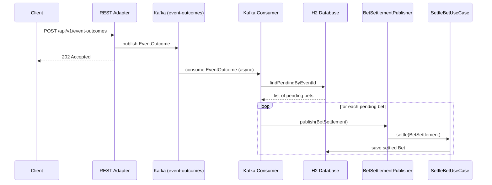

# Architecture

The service follows **Hexagonal Architecture** (Ports and Adapters). The domain and application
layers have no knowledge of Spring, Kafka, JDBC, or any other infrastructure. All framework
dependencies are confined to adapters.

## Layers

**Domain** — pure Java records and logic. No framework annotations, no infrastructure imports.
Models the `Bet` lifecycle: `PENDING → WON | LOST`.

**Application** — use cases that orchestrate the domain. Depends only on domain classes and
port interfaces. Never on adapters.

**Adapters** — all Spring/Kafka/JDBC code. Two kinds:

- *Inbound*: receive external input and call use case ports (REST, Kafka consumer)
- *Outbound*: implement use case ports to reach external systems (Kafka publisher, database, settlement)

## Package structure

```
eu.cleankod.settlementtrigger
  domain/           ← pure domain model and exceptions
  application/
    port/in/        ← inbound use case interfaces
    port/out/       ← outbound port interfaces
    service/        ← use case implementations
  adapter/
    in/rest/        ← REST controller and error handling
    in/kafka/       ← Kafka consumer
    out/kafka/      ← Kafka producer
    out/persistence/← Spring Data JDBC repository
    out/settlement/ ← settlement publisher (mock + local)
  config/           ← Spring configuration
```

## Settlement flow



### Profile-based settlement

`BetSettlementPublisher` has two implementations, active on mutually exclusive profiles:

| Profile  | Class                           | Behaviour                                                                                      |
|----------|---------------------------------|------------------------------------------------------------------------------------------------|
| `local`  | `LocalBetSettlementPublisher`   | Logs the command and calls `SettleBetUseCase` directly — full end-to-end flow without RocketMQ |
| `!local` | `LoggingBetSettlementPublisher` | Logs the command as JSON only — simulates publication to RocketMQ                              |

In production, the `!local` publisher would be replaced by a real RocketMQ producer, and a
separate inbound adapter (`@RocketMQMessageListener`) would deliver messages to `SettleBetUseCase`.

## Dependency rule

Dependencies always point inward. Adapters depend on application ports; application depends on
domain; domain depends on nothing.
